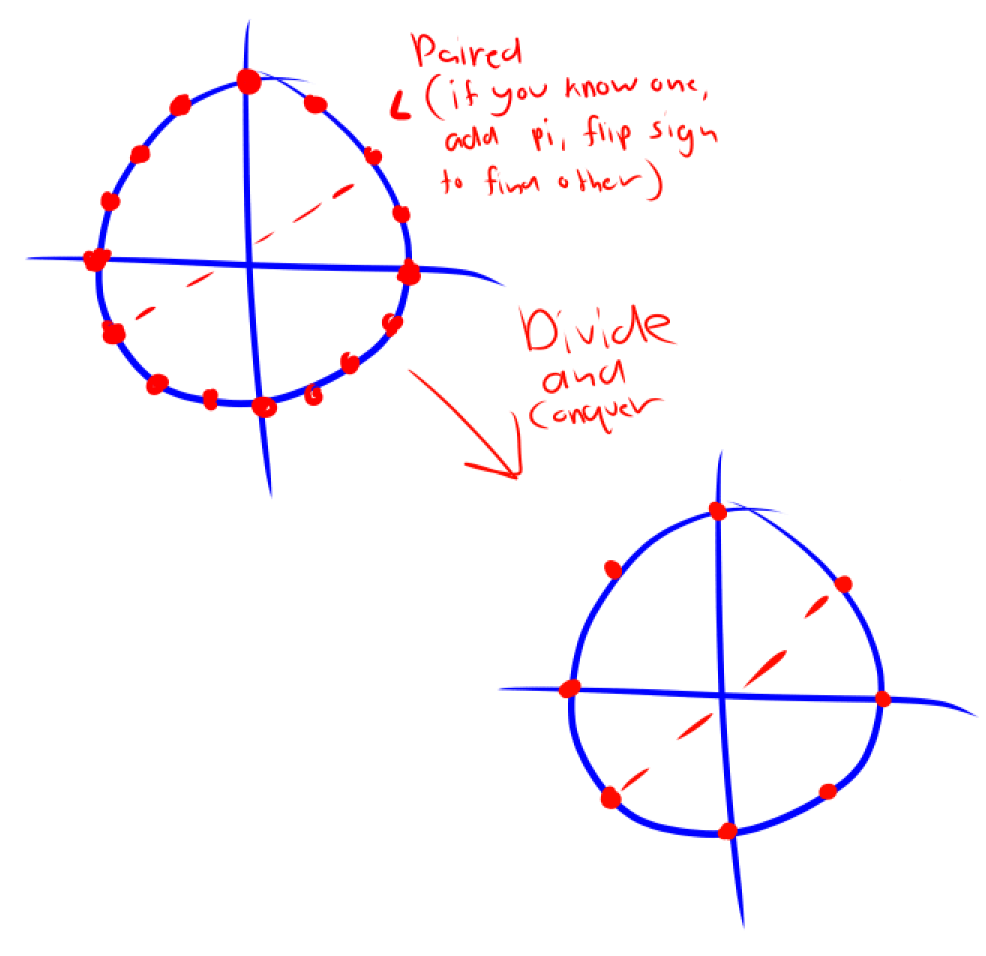

# Fast Fourier Transform

## Polynomial Multiplication

Suppose we have two input polynomials,

$$
A(x) = a_0 + a_1x + a_2x^2 ... a_{n-1}x^{n - 1}\\
B(x) = b_0 + b_1x + b_2x^2 ... b_{n-1}x^{n - 1}
$$

such that $$n = 2d - 1.$$ 

### Relationship Between Polynomial and Integer Multiplication

Given ints $$\alpha, \beta$$, and we want $$\gamma = \alpha\beta.$$ Given the coefficients, we want to compute the coefficients of the product polynomial. 

### Possible Algorithms:

First, we have the straight-forward algorithm. We have

$$
c_0 = a_0b_0\\
c_1 = a_0b_1 + a_1b_0\\
c_k = \sum_{j= 0}^ka_jb_{k - j}
$$

Total time to compute this is $$O(N^2)$$ since we need to loop over $$j = 0$$to $$N - 1$$. Computing each of $$\frac{c_n}{4}$$requires $$\geq \frac{N}{4}$$flops, meaning we're gonna have $$\Theta(N^2)$$flops. 

Second, we have a Karatsuba related approach. Recall that we have

$$
A(x) = a_0 + a_1x + a_2x^2 ... a_{n-1}x^{n - 1}\\
B(x) = b_0 + b_1x + b_2x^2 ... b_{n-1}x^{n - 1}
$$

We can split this up into lows and highs as we did for integer multiplication, that is 

$$
A(x) = A_l(x) + x^{\frac{n}{2}} + A_h(x)\\
B(x) = B_l(x) + x^{\frac{n}{2}} + B_h(x)
$$

It's the same as last time — you'd get four recursive polynomial multiplications to do with half the degree, but applying the Karatsuba trick, we'd only have three polynomial multiplications, meaning we'd have, just like Karatsuba, $$\Theta(n^{\log_23}).$$ 

Finally, we have an even faster approach using polynomial interpolation. 


Polynomial intermolation states that a degree $$< N$$polynomial can be uniquely determined by its evaluation on $$N$$distinct points \(refer to CS 70, Lagrange interpolation\)


Instead of directly computing the coefficients of C, we can determine $$C(x_0) ... C(x_{n - 1})$$. We can therefore compute the evaluation of $$A(x)$$and $$B(x)$$on $$N$$distinct points each, then multiply them, and then just interpolate them to find $$C(x).$$

## Fast Fourier Transform


Clarification: The Discrete Fourier Transform is a matrix, and the Fast Fourier Transform is an algorithm.


In order to increase the efficiency of our algorithm, we can choose our points as $$\pm x_0, \pm x_1, \pm x_2$$, et cetera, because then the computation for the even powers would be the same, saving us a lot of resources. 

The main issue, is, this only works at the top level of recursion; that is, the second level is all squares, meaning there can be no negatives. However, we can use complex numbers to get around this. The main question is, which complex numbers do we use? We can start from bottom up. We start off with one, which we can split into $$1$$and $$-1$$. $$-1$$is split into $$i$$and $$-i$$, and we already know what $$1$$ splits into. We continue until we reach a set of $$n$$points to use for our interpolation.

We call these roots of one the $$n$$th complex roots or unity. In other words, the solutions to $$z^n = 1$$. For even $$n$$, the numbers are plus-minus paired, and their squares are the $$n/2$$th roots of unity.

Here is a diagram,



Of course, in order to pull this off, we split $$A(x)$$into its odd and even powers, such that this trick can be used for both.

$$
A(x) = A_e(x) + xA_o(x)\\
A_e(x) \text{ represents the even powers of }A(x)\\
A_o(x) \text{ represents the odd powers of }A(x)
$$

We factor out $$x$$from $$A_o(x)$$\(the odd powers\) so the powers inside become even. We can therefore write our function as 

```python
FFT(A, omega):
    # Input is coefficient rep of A(x) of degree n - 1, n is a power of
    # 2 omega, an nth root of unity.
    # We want to output A(omega) ... A(omega^{n - 1}) so we can use 
    # lagrange interpolation to find the original polynomial
    if (omega - 1):
        return A(1)
    even_pol, odd_pol = split(A) #Splits into odd/even pwrs
    even_results = FFT(even_pol, omega^2) #Refer to the diagram
    odd_results = FFT(odd_pol, omega^2)
    for j in range(n): #0 to n - 1
        find A(w^j), which is even_result[j] + omega^j * odd_result[j]
    return A(omega) ... A(omega^{n - 1}) #Computed by the for loop
```

### Matrix Representation

For a polynomial with degree $$n-1$$, we can represent the set of polynomials $$A(x_0)\ ...\ A(x_{n-1})$$as a matrix-vector equation. The matrix is called a _Vandermonde_ matrix, which we will call $$M(x).$$

$$
\begin{bmatrix}
A(x_0)\\
A(x_1)\\
A(x_2)\\
\vdots\\
A(x_{n-1})
\end{bmatrix} = 
\begin{bmatrix}
1 & x_0^2 & x^3_0 & ... & x_0^{n-1}\\
\vdots & \vdots & \vdots & \vdots & \vdots\\
1 & x_{n-1}^2 & x^3_{n-1} & ... & x_{n-1}^{n-1}
\end{bmatrix}
\begin{bmatrix}
a_0\\
a_1\\
a_2\\
\vdots\\
a_{n-1}
\end{bmatrix}
$$

Using this same model we can represent the FFT as $$M_n(\omega).$$


Inversion is possible — $$M_n(\omega)^{-1} = \frac{1}{n}M_n(\omega^{-1})$$


Of course, since we're looking for even powers, we'd have to split the matrix up between the even and odd powers, and rearrange the coefficient vector accordingly. 

