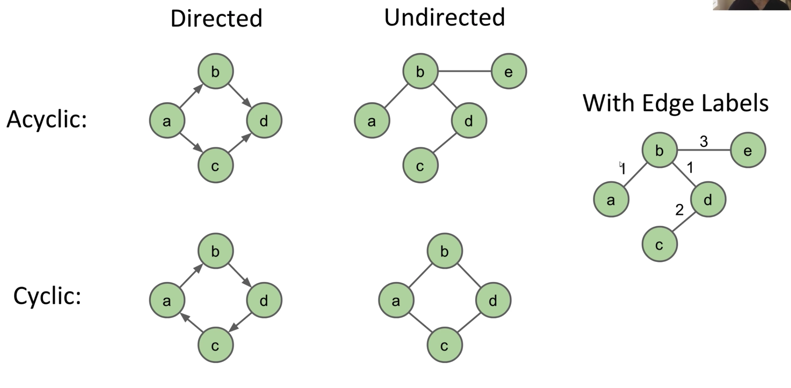

# Graphs, Tree Traversals

## Depth First Traversals

### "Preorder" Traversal

In this kind of traversal, we "visit" a node, and then traverse its children. From lecture, we have the following code for that.

```java
void preOrder(BSTNode x) {
    if (x == null) return;
    print(x.key); //"Visiting" the node
    preOrder(x.left); //Traversing its children.
    preOrder(x.right); 
}
```

### "Inorder" Traversal

Here, we traverse left child, visit, then traverse right child.

```java
void inOrder(BSTNode x) {
    if (x == null) return;
    inOrder(x.left); //Traversing its children.
    print(x.key); //"Visiting" the node
    inOrder(x.right); 
}
```

### "Postorder" Traversal

Traverse both children, and then visit the node.

```java
void postOrder(BSTNode x) {
    if (x == null) return;
    postOrder(x.left); //Traversing its children.
    postOrder(x.right); 
    print(x.key); //"Visiting" the node
}
```


Visual trick for humans: Trace a path around the graph, from the top going counter-clockwise, and:  
Preorder traversal: Visit every time we pass the left of a node.  
Inorder traversal: Visit when we cross the middle of a node.  
Postorder: Visit when we cross the right of a node.


## Graphs

Graphs are like trees, but without the restriction that each node may only have one path to every other node. This means that a node can have 1, 2, 3, or no paths to another node. 

* A graph has a set of nodes, which may or may not be connected by edges.
* A graph has a set of edges, each of which connects to nodes.

Furthermore, a graph is a simple graph if:

* There are no "loops" \(edges that connect a node to itself\)
* There are no parallel edges \(two edges that connect the same two nodes\)


In CS61B, **unless stated otherwise**, all graphs are **simple.**


### More Graph Types



Directed graphs have edges with directionality, whereas undirected does not. Cyclic graphs contain cycles, but acyclic graphs are trees \(if all of the nodes are connected\).

Edges are also often labeled with weights. 

### More Terminology

* Nodes with an edge between them are adjacent. 
* A path is a sequence of vertices connected by edges.
* A cycle is a path whose first and last vertices are the same. If a graph contains a cycle, it is cyclic.
* A connected graph is a graph where each node has a path to every other node.

