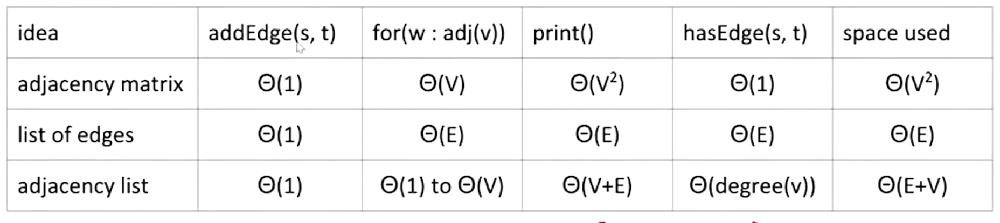

# Graphs, Tree Traversals

## Depth First Traversals

### "Preorder" Traversal

In this kind of traversal, we "visit" a node, and then traverse its children. From lecture, we have the following code for that.

```java
void preOrder(BSTNode x) {
    if (x == null) return;
    print(x.key); //"Visiting" the node
    preOrder(x.left); //Traversing its children.
    preOrder(x.right); 
}
```

### "Inorder" Traversal

Here, we traverse left child, visit, then traverse right child.

```java
void inOrder(BSTNode x) {
    if (x == null) return;
    inOrder(x.left); //Traversing its children.
    print(x.key); //"Visiting" the node
    inOrder(x.right); 
}
```

### "Postorder" Traversal

Traverse both children, and then visit the node.

```java
void postOrder(BSTNode x) {
    if (x == null) return;
    postOrder(x.left); //Traversing its children.
    postOrder(x.right); 
    print(x.key); //"Visiting" the node
}
```


Visual trick for humans: Trace a path around the graph, from the top going counter-clockwise, and:  
Preorder traversal: Visit every time we pass the left of a node.  
Inorder traversal: Visit when we cross the middle of a node.  
Postorder: Visit when we cross the right of a node.


## Graphs

Graphs are like trees, but without the restriction that each node may only have one path to every other node. This means that a node can have 1, 2, 3, or no paths to another node. 

* A graph has a set of nodes, which may or may not be connected by edges.
* A graph has a set of edges, each of which connects to nodes.

Furthermore, a graph is a simple graph if:

* There are no "loops" \(edges that connect a node to itself\)
* There are no parallel edges \(two edges that connect the same two nodes\)


In CS61B, **unless stated otherwise**, all graphs are **simple.**


### More Graph Types


Directed graphs have edges with directionality, whereas undirected does not. Cyclic graphs contain cycles, but acyclic graphs are trees \(if all of the nodes are connected\).

Edges are also often labeled with weights. 

### More Terminology

* Nodes with an edge between them are adjacent. 
* A path is a sequence of vertices connected by edges.
* A cycle is a path whose first and last vertices are the same. If a graph contains a cycle, it is cyclic.
* A connected graph is a graph where each node has a path to every other node.

### Some Graph Queries

* s-t path — is there a path between vertices s and t?
* connectivity — is the graph connected, and is there a path between all vertices?
* biconnectivity — is there a vertex whose removal disconnects the path?
* shortest s-t path — what is the shortest path between vertices s and t?
* cycle detection — does the graph have any cycles?
* **euler tour —is there a cycle that uses every edge exactly once?**
* **hamilton tour — is there a cyle that uses every vertex exactly once?**
* planarity — can you draw a graph on paper without any edges crossing?
* isomorphism — are two graphs actually the same?

### Depth First Search

DFS is an algorithm that traverses all of the subnodes of a child node to the very end before moving on to the next child.

Just like tree traversals, there are preorders and postorders.

### Breadth First Search

Breadth-first search is actually non-recursive. 

1. Initialize a queue with a starting vertex s, and mark that vertex. 
2. Repeat until the queue is empty
   1. Remove vertex v from the front of the queue
   2. For each unmarked neighbor of v
      1. Mark n
      2. Set edgeTo\[n\] = v \(or track the distance if you want\)
      3. Add n to the end of the queue.

### Building a Graph API

* Our graph is of numbers, which can map to different values using a different data structure. 
*  We represent our graph using an adjacency list, where we have an array that contains all of the vertices that it is connected to.

Here is a graph of runtimes for certain operations with different data structures for graphs.                                                                                                                                                            



### Possible Code

From lecture, here is DepthFirstPaths, with comments.

```java
public class DepthFirstPaths {
    private boolean[] marked;
    private int[] edgeTo;
    private int s;
    public DepthFirstPaths(Graph g, int s) {
        ...
        dfs(G, s);
    }
    private void dfs(Graph G) {
        marked[v] = true; // Mark the node as visited so we don't come back to it
        for (int w: G.adj(v)) {
            if (!marked[w]) {
                edgeTo[w] = v; //Visit the node. In this case, we record the edge.
                dfs(G, w); //dfs the rest
            }
        }
    }
}
```

From lecture, here is BreadthFirstPaths, with comments.

```java
public class BreadthFirstPaths {
    private boolean[] marked;
    private int[] edgeTo;
    public BreadthFirstPaths(Graph G, int s) {
        ...
        bfs(G, s);
    }
    
    private void bfs(Graph G, int s) {
        Queue<Integer> fringe  = new Queue<Integer>();
        fringe.enqueue(s); // Starting vertex
        while (!fringe.isEmpty()) {
            int v = fringe.dequeue(); //Dequeue the first item inside the queue
            for (int w : G.adj(v)) { // Deal with each of v's kids
                if (!marked[w]) {
                    fringe.enqueue(w); // Ensures we're going breadth-first
                    marked[w] = true;
                    edgeTo[w] = v;
                }
            }
        }
    }
}
```

## Shortest Paths

Right now, we have DFS and BFS for traversing graphs and finding paths. If we use BFS, we will get the shortest path in terms of number of edges.

Space efficiency is worse for DFS in the case of a spindly graph, but BFS is worse for a bushy graph. In both of these worst cases, $$\Theta(V)$$ space is required.

In order to get the correct shortest paths, we need to take into account the "weight" of the edges. 

### Djikstra's Algorithm

Djikstra's algorithm is a method of finding the SPT of a node in a graph. It works as follows.

* Insert all vertices of the source into fringe PQ, inserting in order from the source.
* Remove the closest vertex from the PQ, and relax all edges pointing to it.


To relax an edge is to only add it to the shortest-paths tree if it yields a better distance.


This algorithm assumes that there are no edges that have negative weights. 

| Operation | Cost Per Operation | Total Cost |
| :--- | :--- | :--- |
| PQ Add | $$\text{O}(log V)$$  | $$\text{O}(Vlog V)$$  |
| PQ removeSmallest | $$\text{O}(log V)$$  | $$\text{O}(Vlog V)$$  |
| PQ changePriority | $$\text{O}(log V)$$  | $$\text{O}(Elog V)$$  |

Our total runtime, assuming that there are more edges than vertices, is $$\text{O}(Elog V)$$ 

### A\*

Basically the same as Djikstra's, but instead of the standard **best-first search** we add an estimated distance to our goal when considering which vertex to visit. Does not yield a valid shortest-paths tree, because we only care about finding one number.

## Spanning Trees

A **spanning tree** is:

* A tree.
* Contains all the nodes of a graph.
* Does not contain cycles.

A **minimum spanning tree** is:

* A spanning tree that has the minimum total weight.

### Cuts

Two definitions:

* A **cut** is when a graph's nodes are split into two different sets.
* A **crossing edge** is any edge that connects a node from one of the sets to another.

For any cut, the minimum crossing edge is guaranteed to be a part of the minimum spanning tree.

### Prim's Algorithm

Prim's algorithm works as follows.

* Add a node to the MST.
* Add the shortest edge that has only one node in the MST into the MST, adding the newly connected node to the MST.
* Repeat above.

Algorithmically, this is what it boils down to.

* Decide on a source node to be the start of the MST.
* Insert all other vertices into a fringe, sorted by distance from tree \(assume that the not-connected edges are infinity distance away for now\)
* Remove the closest vertex, adding is edge to the MST, and relax all edges pointing from v.

Runtime-wise, worst case is the same as Djikstra's algorithm.

### Kruskal's Algorithm

Kruskal's algorithm does the following. Considering edges in increasing weight,

* Consider edges in increasing weight
* If it does not cause a cycle, add it to the MST.

For this, runtime is $$\text{O}(ElogE)$$.

