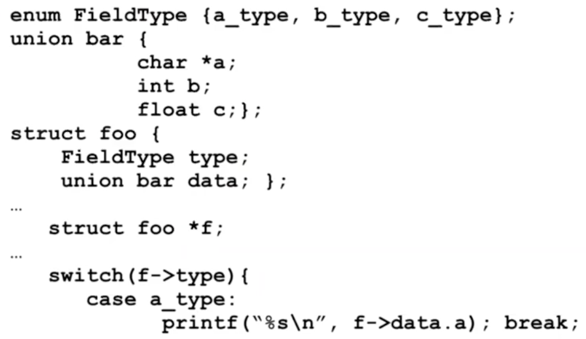

# Pointers and Memory

## Memory

Memory in C is split up into the stack memory \(things that are not manually allocated, data becomes garbage after the function which used it returns\), the heap memory, \(things that you manually allocate with `malloc` , `calloc`, or `realloc`\). 

Allocated memory always holds garbage until it is initialized.                  

## Pointers

C uses pointers to memory explicitly. Here is an example:

```c
int x = 2;
int *p = &x;
```

Just like in Java, line 1 stores the two in a box in memory. However, p is a pointer, and its value is an address to an int. In order to recover that int, we **dereference the pointer,** using `*p`.

Here are a few examples for using pointers.

```c
int a; /* An integer value. */
int *p; /* A pointer to an integer. */
char **q; /* A pointer to a pointer to a character */

a = *p; /* Setting a to the value held at p */
```


One possible point of confusion is the use of `*` in both declaring something is a pointer as well as dereferencing pointers. Be aware of the difference.


## Memory Management

C's memory is just a large amount of bits, each byte having an address from `0` to `0xFFFFFFFF`. We think in terms of words, which we consider as big enough to hold an address. 

There are four components C's memory.

* Stack: local variables inside functions, grows downwards.
* Heap: Space requested using `malloc()`. Grows upward.
* Static data: variables declared outside functions, does not grow or shrink, can be modified. Loaded when the program starts.
* Code: Loaded when program starts and does not change
* `0x00000000`, unwritable and unreadable so your program crashes when you attempt to access null pointer.

```c
int steven;
main() {
    int bald;
}
```

In this example, `bald` would go inside the stack, and `steven` would go inside static data. With these, memory management is automatic.


Variables no longer exist once the function exists — that is, if you make `int bald;` inside a function, you cannot do `return &bald;`! In Java, we would be allowed to do this.


### The Stack

When you call a function, a new "stack frame" is allocated. It includes:

* Return address \(what called the function\)
* Arguments
* Local variables

The "stack pointer" indicates the start of the stack frame. When a function ends, the stack pointer moves up, creating more space for future stack frames. Creation and destruction goes in the order of "last-in, first out."

### The Heap

| Thing | What it does |
| :--- | :--- |
| `malloc()` | Allocates a block of uninitialized memory. Just use `sizeof()` to find the amount of memory you need for the thing you want to allocate memory for. |
| `calloc()` | Allocate a block of zeroed memory |
| `free()` | Free previously allocated block of memory |
| `realloc()` | Change size of previously allocated block, though it might move the memory. Returns the pointer to the new location, which may or may not be the same. |

Some potential problems with the heap are:

* Memory leak: you forgot to deallocate memory.
* Double free: you free the same memory twice.
* Use after free: you use data after freeing it.


When `malloc()` for a string, remember to add 1 to `strlen()` because that functiond oes not account for the null terminator.


If you want to hold different items in the same location, use a `union` instead of a `struct.`



Make sure you don't try and free memory in the stack.

### Alignment

Some alignment rules:

* char: 1 alignment needed
* short: 2 bytes, 1/2 word aligned, so 0, 2, 4, 6
* int: 4 bytes, word aligned, 0, 4, 8, etc

Structs must be aligned if they contain anything that wants alignment.

### Pointers to Functions

If you have a function definition, you can create a pointer of that type. For example, we have

```c
char *steven(char *a, int b){/*Things related to Rogaine*/}
char *(*f) (char *, int); /*f is a function taking a char* and int and returning char*/
bald = &steven; /*create a reference to the steven function*/
(*steven)("pepega", 3); /*Call the function*/  
```

