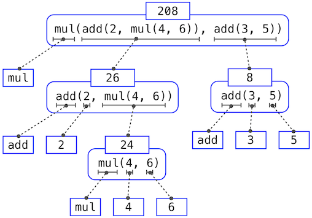

# Call Expressions, Names, etc.

An example of a call expression is the following.

```python
operator(operand, operand)
```

There is a specific evaluation procedure for call expressions.

* Evaluate the operator, and then the operand expressions.
* Apply the operator to the evaluated operand expressions.


Note that you can **nest** call expressions. In other words, operands can be other operator with its own operands.



Anything that evaluates to a function is an operator.


Things like numbers, names, etc are just called primitive expressions.

Evaluation rules for assignment statements.

* Evaluate all expressions to the right of = from left to right
* Then, bind the names.

Evaluation rules for assignment statements.

* Create a function with &lt;name&gt;\(&lt;parameters&gt;\)
* Set the body of the function to everything indented after the first line but do not execute it
* Bind the name to the function in the current frame.

### Imports

Sometimes, you need to import functions in order to use them. Examples of such functions are below.

```python
from operator import add, sub, mul
```

Now, you will have access to the three functions add, sub, mul.

### Evaluating a nested expression

Here is an illustration of the previously described method of evaluating an expession, but with a more visual approach.



### Pure v.s. Non-Pure Functions

Pure functions simply have input and return some output. They have no effect other than simply returning a value. 

_Non-Pure_ functions, however, have some affect other than just returning a value. Take the following code, for example.

```python
>>> print(print(1), print(2))
1
2
None None
```

Here is the order in which things are done.

* `print(print(1), print(2))` is evaluated. In doing so, the operator, `print`, is applied to the operands.
* The operands are evaluated. `print(1)` is an operand, which is evaluated to an operator. As such,  it is applied to _its_ operand, `1`, which is printed to the console. It returns `None`.
* `print(2)` is an operand, which is evaluated to an operator. As such,  it is applied to _its_ operand, `2`, which is printed to the console. It returns `None`.
* Since both print statements returned `None` and `print` is being applied to both `None`, `None` is printed twice.


