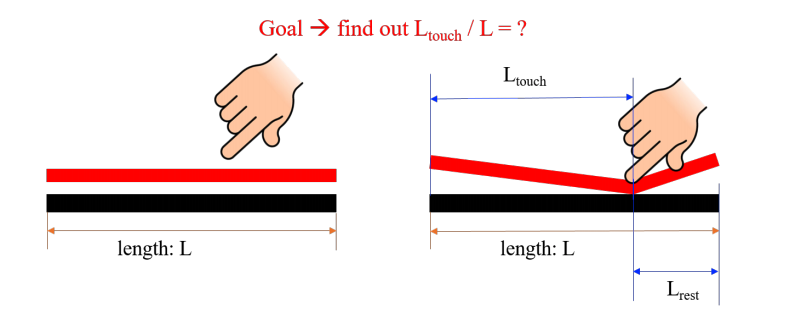
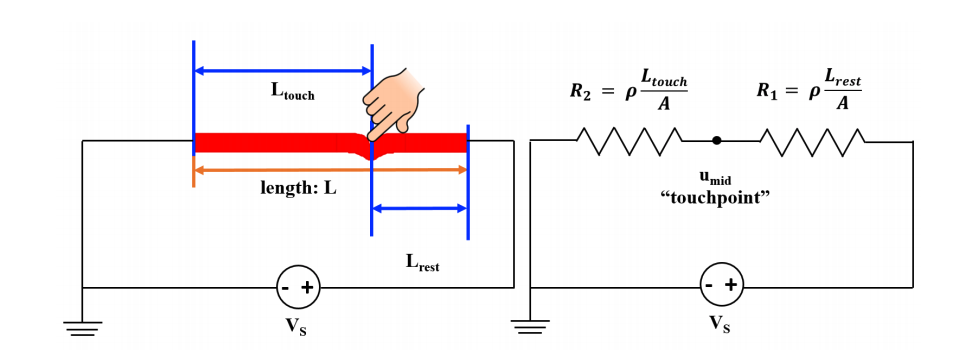

# Resistive Touchscreen

## 1D Model

We can simplify the touchscreen to a 1D structure in order to gain a better understanding of how it works. 

We want to calculate the $$L_{touch}$$ in order to find the position of the touchpoint. As we know, it, $$I = \frac{dQ}{dt}$$ , where $$Q$$ and $$I$$ are charge and current respectively. We measure current in **amps**, which amounts to one coulomb per second.

The **resistance** of a conductive material is given by the equation $$R = \rho \frac{L}{A}$$ , where rho is the **resistivity** \(a number unique to each material\) L is the length and A is the cross-sectional area.

As you can see, you write the resistances of the two resistors in terms of the resistivity, which brings length into the equation, allowing you to solve for $$L_{touch}$$ using node voltage analysis. Simply solve for $$u_{mid}$$ in terms of $$R_1$$ and $$R_2$$, and then you can plug the resistivities in.

## Power

