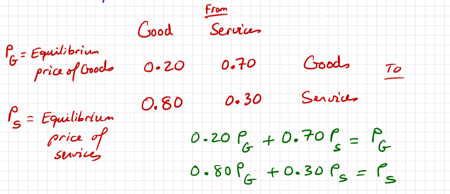
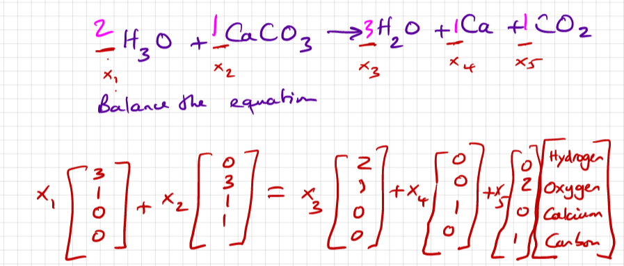

# Chapter 1: Linear Equations in Linear Algebra

## The Basic Linear Equation

A so-called linear equation is defined as follows, where the coefficients are _real_ or _complex_ numbers.

$$
a_1x_1 + a_2x_2 + a_nx_n =b
$$

Somewhat obviously, a solution of a system of linear equations is a list of numbers \(substituted for x in their respective order\) that makes each equation true. As per mathematical paradigm, a system of linear equations can have the following types of solutions.

* No solution \(called an inconsistent system\).
* Exactly one solution.
* Infinitely many solutions.


Note: typically, inconsistent systems involve augmented matrices such that \[zero\|nonzero\]. In layman's terms, a system that incorrectly states that zero equals nonzero.


## Systems of Linear Equations as Matrices

We of course represent systems of linear equations with matrices. Shown is a typical 3x4 matrix.

$$
\begin{bmatrix}
5 & 2 & 3 & 1\\
2 & 6 & 0 & 5\\
8 & 3 & 1 & 4
\end{bmatrix}
$$

Now, for some definitions. Memorizing these is honestly trivial. A **coefficient matrix** is simply a matrix of coefficients, in the following form.

$$
\begin{bmatrix}
a_1 & a_2 & a_3 & a_4
\end{bmatrix}
$$

**Augmented matrices** are simply coefficient matrices with the _b_ constant "augmented" on it — like so.

$$
\begin{bmatrix}
a_1 & a_2 & a_3 & a_4 & b
\end{bmatrix}
$$

Of course, your typical matrix in this class will not be the 1 row ones that are shown — in fact, I have not even described a system of linear equations with either of them. Each row represents one linear equation. One more quick vocab to note — one that is likely non-trivial — two matrices are said to be **row equivalent** if there is a sequence of **elementary row operations** that transforms one into the other — these are quite simple and will be covered in the next section.

## Elementary Row Operations

This section is short and easy but nevertheless important. There are three operations that can be performed on a row, and these are as follows.

* **Replacement** — replacing one row by the sum of itself.
* **Interchange** — interchange two rows
* **Scaling —** multiply a row by a **NONZERO** scalar.

## Row Reduction

The process of row reduction is a tedious, yet simple one. The gist of it is that you perform elementary row operations on a matrix until you reach a desired outcome. The **leading term of a row** refers to the leftmost nonzero term. A **nonzero row,** quite obviously, is a row with a nonzero term.

A matrix is said to be in **echelon form** if the following conditions are met.

* All nonzero rows are **above** any rows that are all zeroes.
* Each leading term of a row is to the **right** of the leading term of the row that is below it.
* All terms below each leading entry is a zero. 

By satisfying two more conditions, a matrix is said to be in **row echelon form** or **reduced row echelon form.**

* All leading terms must be 1.
* Each leading term is the only nonzero entry in its column \(reduced row echelon form\) **reduced row echelon form ONLY.** _**If this condition is not fulfilled the matrix is only in row echelon form.**_

The echelon forms are the "desired outcomes" I mentioned in the opening paragraph of this section.

## Solving Systems of Linear Equations

The objective of getting matrices to row echelon form is, of course, to solve the system of linear equations. Once the matrix is in row echelon form, simply rewrite each equation and solve the system of equations.

There are a few caveats worth mentioning. The most important to consider is the **free** **variable**, which, loosely defined, is a variable whose coefficient is zero.

$$
\begin{bmatrix}
1&-3&0&-5\\
0&-2&0&-6
\end{bmatrix}
$$

Observe that there is a zero in the third position of the second row. This means that the coefficient to x\_3 is zero. Let's look at what this does to the second equation.

$$
0x_1-2x_2+0x_3=-6
$$


Note that although the x\_1 has a coefficient of zero, it is not a free variable because that variable represents the leading term in the first row.


The first thing that comes to mind is that, well, now x\_3 can be anything. Solving the system of equations, we find the following.

$$
x_3=x_3\\
-2x_2=-6\\
x_1-3x_2+0x_3=-5
$$

Simplify and find that x\_1 = 4, x\_2=3, and x\_3=x\_3. As such, we state that x\_3 is a number in the set of all real numbers.

Conveniently in the former example, every variable in the column that contained the free variable was a zero. What if this is not the case? Here's an example of that exact situation.

$$
\begin{bmatrix}
1 & 0 & -5 & 0 & -8 & 3\\
0 & 1 & 4 & -1 & 0 & 6\\
0 & 0 & 0 & 0 & 1 & 0\\
0 & 0 & 0 & 0 & 0 & 0\\
\end{bmatrix}
$$

By rewriting the systems of equations and simplifying, you should find the following.

$$
x_1 = 3 + 5x_3\\
x_2 = 6-4x_3+x_4\\
x_3=x_3\\
x_4=x_4\\
x_5=0
$$

In which case, simply write the solution as a matrix equation, with the constants in a 5x1 matrix + the variables multiplied by their respective coefficients in 5x1 matrices. It's honestly simpler to show you.

$$
\begin{bmatrix}
x_1\\
x_2\\
x_3\\
x_4\\
x_5\\
\end{bmatrix}=
\begin{bmatrix}
3\\
6\\
0\\
0\\
0\\
\end{bmatrix}+x_3
\begin{bmatrix}
5\\
-4\\
1\\
0\\
0\\
\end{bmatrix}+x_4
\begin{bmatrix}
0\\
1\\
0\\
1\\
0\\
\end{bmatrix}
$$

## Vectors

For the purposes of this class, a matrix with one column only is called a **vector**. Matrix equations can be written as vector equations.

$$
\begin{bmatrix}
1 & 0 & -5\\
0 & 1 & 4\\
\end{bmatrix}
\begin{bmatrix}
x_1\\
x_2\\
x_3\\
\end{bmatrix}=
x_1
\begin{bmatrix}
1\\
0\\
\end{bmatrix}+
x_2
\begin{bmatrix}
0\\
1\\
\end{bmatrix}+ x_2
\begin{bmatrix}
-5\\
4\\
\end{bmatrix}
$$

When multiplying a matrix **A** by a vector **x**, there must the the same number of entries in the vector as there are columns in the matrix.


If one vector is equal to the scalar multiples of other vectors, it is a defined as a **linear combination** of the two vectors.


With the above definition in mind, we realize that we can find out if a vector is a linear combination of another set of vectors using a matrix system of equations. If the resultant augmented matrix formed from the vectors is consistent then it is possible that it is a linear combination.


Notation: We denote all linear combinations of vector u and vector v by Span{ u, v }


## Properties of Matrix Equations as Vector Equations

The following four statements are logically equivalent. Meaning, if any one of them is true, all of them are true, and vice versa.

* For each vector B in ℝ^m, the equation Ax = b has a solution.
* Each B in ℝ^m is a linear combination of the columns of A
* The columns of A span ℝ^m
* A has a pivot in every row

## Applications of Systems of Linear Equations

There are a few applications of linear equations to take note of.

#### Finding the center of mass

Given n points \(x\_n, y\_n\) and n weights \(w\_n\) we can find the center of mass using vector equations as follows.

$$
\frac{1}{\sum m_n}
\begin{bmatrix}
m_1
\begin{bmatrix}
x_1\\
y_1
\end{bmatrix}
+
m_2
\begin{bmatrix}
x_2\\
y_2
\end{bmatrix}+ ... 
m_n
\begin{bmatrix}
x_n\\
y_n
\end{bmatrix}
\end{bmatrix}
$$

You end up with a vector representing the position of the center of mass.

#### Moving the center of mass

If you want to add mass to a system so that the center of mass equals a point \(x\_f, y\_f\), it can be achieved by doing the following.

$$
\frac{1}{\sum m_n}
\begin{bmatrix}
(m_1+m_{1}^{additional})
\begin{bmatrix}
x_1\\
y_1
\end{bmatrix}
+
(m_2+m_{2}^{additional})
\begin{bmatrix}
x_2\\
y_2
\end{bmatrix}+ ... 
(m_n+m_{n}^{additional})
\begin{bmatrix}
x_n\\
y_n
\end{bmatrix}
\end{bmatrix}\\=
\begin{bmatrix}
x_f\\
y_f
\end{bmatrix}\\
m_{1}^{additional} + m_{2}^{additional} + m_{n}^{additional}=m^{\sum additional}
$$

Looks ugly, but if you simplify the first equation you will find that you can create a system of linear equations to determine the additional masses.

#### The input-output production model

The "equilibrium price" refers to a value that can be assigned to total outputs of various sections in such a way that the income of each sector balances the expenses.

When you solve this kind of model, you should always get a free variable. If you solve the system of linear equations you should find that you'll get a set of ratios which you can then use to solve for the desired value.

#### Balancing Chemical Equations

There isn't really a good way to format this in LaTeX so I will just use images again. 

From here, simply solve the system of linear equations by converting it into a matrix equation.

## Ax = 0 — The Homogeneous System of Equations

Ax = 0 always has a solution because x = 0 always works. This solution is called the **trivial solution.**

A homogeneous system of equations can have a non-trivial solution if there is at least one free variable. The answer will be in the form Span{}.

## Linear Dependance

Think of linear dependance this way: when you have a free variable in a system of linear equations, the values of other variables, when solved, will **depend** on that free variable. 

There are, however, some formal definitions.

