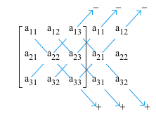

# Chapter 3: Determinants

## Finding the Determinant

The determinant of an n x n matrix can be computed with a cofactor expression across any row or down any column.  

The cofactor expression across the ith row is given by this formula.

$$
det(A)=a_{i1}C_{i1}+a_{i2}C_{i2}\ ...\ a_{in}C_{in}
$$

where

$$
C_{ij}=(-1)^{i+j}det(A_{ij})
$$

where A\_ij is the **submatrix created by deleting the ith row and jth column of A.** As such, in the following example if A\_ij = 1, the following change would occur.

$$
Given A_{ij}=1\\
\begin{bmatrix}
\colorbox{red}{1} & \colorbox{red}2 & \colorbox{red}3\\
\colorbox{red}4&5&6\\
\colorbox{red}7&8&9
\end{bmatrix}
\Longrightarrow
\begin{bmatrix}
5&6\\
8&9
\end{bmatrix} = A_{ij}
$$

As for columns, it is given by this formula.

$$
det(A)=a_{1j}C_{2j}+a_{2j}C_{2j}\ ...\ a_{nj}C_{nj}
$$

C is the same as defined above.

You should get the same answer whatever method you choose.


For matrices larger than 3x3, you will need to compute the cofactor expression multiple times to find the det\(A\) term, as you will always end up with det\(A\_ij\) where A has dimensions n-1 x n-1.


## Finding the Determinant II: The Diagonal Method

The downward diagonal method is an alternative method of finding the determinant. 

Multiply the quantities along the six diagonals, and then you can subtract the top ones and add the bottom ones to find the determinant.

## Properties of Determinants

Given A is a square matrix, and B is the matrix after the operations were performed on it:

* If one row is scaled and then added to another row \(changing only one row\) det A = det B.
* If two rows are interchanged, then det B = det A \* -1
* If a row is multiplied by scalar k, then det B = k \* det A.

There are additional properties that do not involve row 

*  For all square matrices, the determinant of the transpose of A is equal to det A.
* For two square matrices A and B, det AB = det A \* det B

