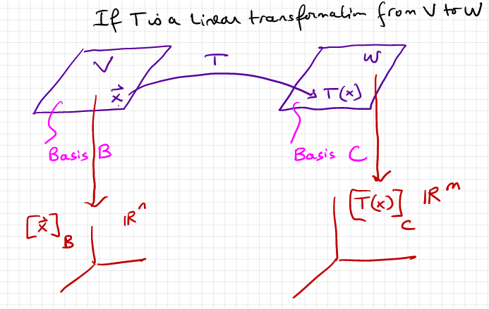

# Chapter 5: Eigenvectors and Eigenvalues

In this section, we will discuss eigenvectors, eigenvalues \(**λ**\) and eigenspaces.

λ is an eigenvalue of matrix A given the following condition.

$$
Ax=λx
$$

Here it is rewritten in a more useful way.

$$
(A-λI)x=0
$$

Where A is an m x n matrix, x is a n x 1 matrix, and λ is a scalar.

Similarly, eigenvectors corresponding to all the λ of A are all the vectors x such that the above condition is bet. Together with the 0 vector, the eigenvectors are a subspace of R^n, referred to as the eigenspace.


Eigenspaces must have at least one nontrivial basis vector. 0 alone cannot be an eigenspace.


Here are brief summaries regarding how to find all three. 

## Finding Eigenvectors/Eigenspaces

Given the following matrix

$$
(A-λI)
$$

The **null space** of this matrix corresponds to the eigenspace of A corresponding to the λ used. That is, augment a column of zeroes and row reduce it. Then you can find the null space.


Note that there are commonly more than one eigenvalues.


It follows that each vector in the eigenspace of A corresponds to an eigenvector.

## Finding Eigenvalues

We know that the matrix discussed in the previous section, \(A - λI\), has a null space, meaning that \(A - λI\)x = 0 has some non-trivial solution. From this, we know that \(A - λI\) is not invertible \(by the Invertible Matrix Theorem, see previous section\).

Therefore,

$$
det(A-λI)=0
$$

When simplifying this, you will find that you get a polynomial with λ as the variable. Simply find the solutions to the polynomial and you will have your eigenvalues.


If A is a triangular matrix, the eigenvalues are the entries on the main diagonal.



If 0 is an eigenvalue of A, A is not invertible.



λ^-1 is an eigenvalue of A^-1


## Diagonal Matrices and Similar Matrices

Somewhat obviously, a diagonal matrix is a matrix in which all non-diagonal entires are zeroes.

A matrix A is diagonalizable if A is similar to a diagonal matrix. A is said to be similar to a diagonal matrix D if there is an matrix P such that the following holds true.

$$
D=P^{-1}AP
$$

Another form of this equation is —

$$
PDP^{-1}=A
$$


If an n x n matrix does not have n distinct values, it is not diagonalizable. Recognizing this early can save a lot of time. 


## Important Theorems to Remember

Following are some important theorems to remember regarding eigenvectors, eigenvalues, and diagonal matrices.

* The dimension of the eigenspace of A is less than the multiplicity \(that is, the highest degree\) of λ.
* A is diagonalizable if the sum of the dimensions of all of the eigenspaces of A equals n.
* If A is diagonalizable and $$B_k$$ is a basis for the eigenspace corresponding to λ\_k for each k, then the total collection of vectors in the sets B\_1, B\_2, B\_k forms an eigenvector basis for R^n.
* The following holds true: 

$$
A^k=PD^kP^{-1}
$$

* In $$A=PDP^{-1},$$ the columns of P are the n Linearly independent eigenvectors of A as well as the diagonal entries of D being the corresponding eigenvalues of A.
* A square matrix is diagonalizable if $$A$$ has exactly $$n$$ linearly independent eigenvectors. That is, the sum of all the bases for all the eigenspaces equals $$n$$ ,
* If 0 is an eigenvalue of $$A$$ , it is **not** invertible.
* Given A is a 2 x 2 matrix with complex eigenvalues, then given $$\lambda=a-bi$$ , in the formula $$A=PCP^{-1}$$ 

$$
P=[Rv\ \ Imv]\\
C=\begin{bmatrix}
a&-b\\
b&a
\end{bmatrix}
$$

* When finding the eigenvectors for a complex eigenvalue, either the first or second row of $$[A-\lambda_1I | 0]$$ may be used.
* Eigenvectors that correspond to distinct eigenvalues are linearly independent.
* Eigenvectors for complex conjugate eigenvalues are also complex conjugates.
* The matrix A is diagonalizable if the dimension of the eigenspace of each $$\lambda_k$$ is equal to the multiplicity of $$\lambda_k$$ 

## A Return to Polynomial Subspaces

A lot of the "new" material that is introduced here is actually fairly intuitive.

If **T** is a linear transformation from v to w, in accordance with the below diagram —

— then the following holds true.

$$
[T(x)]_c=m *[x]_b
$$

where

$$
[[T(b_1)_c],[T(b_2)_c]...[T(b_n)_c]]
$$

This section is probably best shown using examples, so we'll use this one. Just make sure to keep track of all the vocabulary.

Find the **image** of p\(t\) = 3-2t+t^2 given T\(p\(t\)\) = p\(t\)+2t^2p\(t\)

This, of course, means that we plug p\(t\) into the transformation and see what we get.

Show that T is a **linear transformation.**

For this, we can simply ensure that it is closed under scalar multiplication and addition.

$$
T(P_1(t)+P_2(t))=T(P_1(t))+T(P_2(t))\\
T(cP(t)) = cT(P(t))
$$

Plug and chug, pretty much.

Find M, the matrix for T relative to the bases B and C.

Probably should have mentioned this earlier, but given —

$$
B=\{1, t, t^2\}\\
C=\{1.t.t^2.t^3.t^4\}
$$

From here, it's a simple matter of plugging each value into T\(p\(t\)\) for p\(t\). For simplicity's sake, only the t^2 value is demonstrated for B.

$$
T(t^2)=t^2+2t^2(t^2)
$$

We would do that for each thing in each basis and turn the solutions into vectors, which can then be joined into a matrix that represents M.

## B-matrices

The B-matrix for a linear transformation given A and a set of vectors B can be found with the following method.

Given:

$$
B=\{b_1, b_2\}\\
b_1=
\begin{bmatrix}
2\\
1
\end{bmatrix} 
b_2=
\begin{bmatrix}
1\\
1
\end{bmatrix}\\
A=\begin{bmatrix}
-2&-1\\
3&1
\end{bmatrix}
$$

P is given as follows 

$$
P=\begin{bmatrix}
2&1\\
1&1
\end{bmatrix}
$$

And the B-matrix can be found with the following formula.

$$
[T]_b=P^{-1}AP
$$


As we learned earlier, \[T\]\_b is similar to A by the definition of a similar matrix.


Because of the above property, we can actually find a basis B for R\_2 as well as \[T\]\_b given _only_ A. We simply assume that \[T\]\_b is diagonal, meaning that we can find the eigenvalues of A and simply arrange them in a diagonal matrix.

$$
[T]_b=\begin{bmatrix}
λ_1&0\\
0&λ_2
\end{bmatrix}
$$


Note: when reorganizing matrix equations by moving matrices to one side or the other, if a matrix is right multiplied originally it must st right multiplied when moved to the other side, as well as vice versa.


## Angle of Rotation

The angle of rotation $$\Phi$$ can be found with the equation $$\arctan{\frac{b}{a}}$$ .  If a = 0, you can still find the angle if you use $$\arcsin{b}$$ although make sure you divide out the scaling factor or you may run into some trouble.

 

