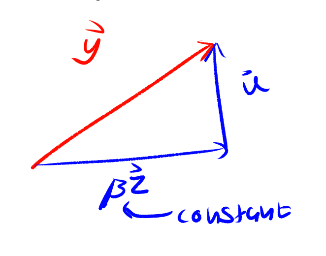

# Projections and Orthogonality

## Dot Products

Dot products are rather simple. Let's say you have a vector $$v$$ with elements $$v_1,v_2,v_3,v_n$$ and so on, and a vector $$u$$ with elements $$u_1,u_2,u_3,u_n.$$ Then the dot product is as follows.

$$
u \cdot v=u_1v_1+u_2v_2+u_nv_n
$$

Here are some properties of dot products.

* $$u\cdot v=v\cdot u$$ 
* $$c(u\cdot v)=(cu)\cdot v=u\cdot(cv)$$ 
* $$(u+v)\cdot p=p\cdot u + v\cdot p$$ 

It's a somewhat uncommon way of expressing it but you can also express the length \(or norm\) of a vector using dot products.

$$
\sqrt{u\cdot u}
$$

## Orthogonal Vectors


Two vectors are orthogonal if their dot product equals zero.


The above concept is an important one to understand. It can be proven with the law of cosines, which I can't be bothered to format in LaTeX, so if you really want to know the proof [here](https://towardsdatascience.com/why-is-the-inner-product-of-orthogonal-vectors-zero-88469043decf) it is.

Let's talk about vector spaces $$W$$ and $$W^{\perp}.$$

We're gonna assume that $$W$$ is a subspace of $$R^n$$.

* $$W^{\perp} $$ is vector space made of vectors where every vector $$v$$ in $$W^{\perp}$$ is orthogonal to every vector in $$W$$ 
* $$W^{\perp} $$ is a subspace of $$R^{n}$$ .


$$W^{\perp}$$ is referred to as the **orthogonal complement** of $$W.$$ 


There are a few important orthogonal complements to take note of based on the vectors that we have learned.

* $$(Row A)^{\perp}=NulA$$ 
* $$(ColA)^{\perp}=NulA^{\intercal}$$ 

In words, this means that all of the columns of Row A are orthogonal to every column in Nul A. The second statement is saying all of the columns of Col A are orthogonal to every row in Nul A.

The proof for this is simply that the definition of a null space of A is that $$Ax=0$$ , meaning that all the dot products of each row of A and x is 0, fitting the definitions of an orthogonal vector.

## Orthogonal Sets

An orthogonal set is a set of vectors in which each vector in the set is orthogonal to every other vector in the set. Note that if the set contains all nonzero vectors, the vectors in the set are linearly independent.

An orthogonal basis for a subspace W in R^n is exactly what it sounds like it is.

Here is a theorem of orthogonal sets. Assuming $$\{u_1, u_2, u_p\}$$ is an orthogonal basis, the weights in the linear combination for each vector $$y$$in $$W$$ \(the orthogonal basis\), $$y=c_1u_1+c_2u_2...etc$$ the weights are $$c_j=\frac{y\cdot u_j}{u_j\cdot u_j}$$.

## Decomposition and Projection

Let's say we had a vector $$y$$ in $$R^n.$$ We can _decompose_ or break up into parts, that vector, into two vectors where one a multiple of some nonzero vector $$u$$ and some other vector orthogonal to it. In other words, observe the diagram.

Here is the notation for the that bottom vector — it is written as $$\beta z=\hat{y}$$. In accordance of our original goal of decomposing the vector $$y$$ into the sum of two vectors, we find that $$y=\hat{y}+z.$$ However, this form useless insofar as we don't know the constant $$\beta.$$ Let's look at a more useful form below that doesn't involve calculating the constant at all.

$$
\hat{y}=\frac{y\cdot u}{u\cdot u}u
$$

## The Orthogonal Decomposition Theorem

Let $$W$$be a subspace of $$R^n.$$ Then each $$y$$ in$$R^n$$can be expressed uniquely in the following form.

$$
y=\hat{y}+z
$$

where $$\hat{y}$$ is in $$W$$ and $$z$$ is in $$W^{\perp}.$$ Keeping in mind that  $$\{u_1, u_2, u_p\}$$ is an orthogonal basis for $$W$$, the following holds true.

$$
\hat{y}=\frac{y\cdot u_1}{u_1\cdot u_1}u_1+\frac{y\cdot u_2}{u_2\cdot u_2}u_2+\frac{y\cdot u_p}{u_p\cdot u_p}u_p
$$

And of course, $$z=y-\hat{y}.$$ 

## The Best Approximation Theorem

Given that $$W$$is a subspace of $$R^n,$$and $$y$$is any vector in $$R^n,$$and $$\hat{y}$$ being the orthogonal projection of $$y$$ onto $$W$$, $$\hat{y}$$is the closest point in $$W$$to$$y$$.

## Properties of Orthonormal Matrices

An orthonormal matrix is a matrix whose columns from an orthogonal basis in $$R^n$$and are all unit vectors \(meaning that each vector's magnitude is one\). Let's look at some theorems of orthonormal bases, given $$U$$ is an orthonormal matrix.

$$
U^{\intercal}U=I\\
UU^{\intercal}=proj_w^y
$$

## The Gram-Schmidt Process

The Gram-Schmidt process is a painful method of finding an orthonormal basis for a subspace. Given any basis for a nonzero subspace  $$W$$of $$R^n,$$the following holds true.

$$
v_1=x_1\\
v_2=x_2-(\frac{x_2\cdot v_1}{v_1\cdot v_1}v_1)\\
v_3=x_3-(\frac{x_3\cdot v_1}{v_1\cdot v_1}v_1+\frac{x_3\cdot v_2}{v_2\cdot v_2}v_2)\\
v_p=x_p-(\frac{x_p\cdot v_1}{v_1\cdot v_1}v_1+\frac{x_p\cdot v_2}{v_2\cdot v_2}v_2+\frac{x_p\cdot v_p}{v_p\cdot v_p}v_p)
$$

## QR Decomposition

A matrix A can be _decomposed_ into a product between orthonormal matrix Q and an upper triangular matrix R. The columns of Q can be found with the Gram-Schmidt process and can be turned into unit vectors.

$$
A=QR
$$

Well, we know Q is orthonormal, so we can rewrite this. Remember a property mentioned earlier, that $$U^{\intercal}U=I$$ where $$U$$ is orthonormal. Therefore, we can rewrite the above equation like so.

$$
Q^{\intercal}A=Q^{\intercal}QR
$$

Which simplifies to

$$
Q^{\intercal}A=IR\Longrightarrow Q^{\intercal}A=R
$$

