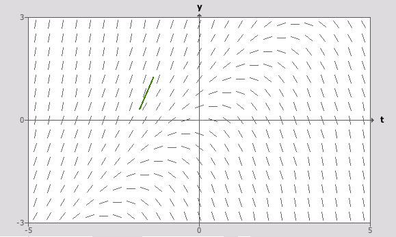
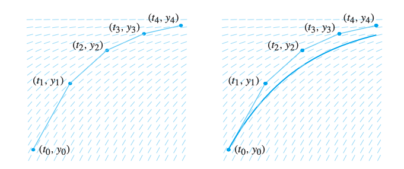

# Modeling via Differential Equations

## The Basic Unlimited Population Growth Model

The basic unlimited population growth model states, simply, that the rate of growth of the population is proportional to the rate of growth of the population.

$$
\frac{dP}{dt}=kP
$$

Now, some vocabulary. The **equilibrium solution** is a solution to the differential equation in which the derivative is zero everywhere. In this case, it would be   
P = 0.

The **initial condition** of a differential equation is the initial value of P\(t\) at t = 0. In other words, the constant C we get from integration.

## The Logistic Population Model

The logistic population model states that if the population is small, the growth is proportional to size, and if it is too large and unsustainable, the population will decrease.

$$
\frac{dP}{dt}=k(1-\frac{P}{N})P
$$

The additional variable, N, is the carrying capacity. We observe that the equilibria positions are N and 0.


Note that the above model is **non-linear.**


## Predator-Prey Systems

Notation wise, prey are denoted as rabbits \(R\) and predators are denoted as foxes \(F\). This type of model follows the following four assumptions.

* When there are no foxes present, rabbits reproduce at a rate proportional to their population.
* The rate at which rabbits are hunted is proportional to the rate at which rabbits and foxes interact.
* When there are no rabbits present, the foxes die at a rate proportional to the population.
* Foxes reproduce at a rate proportional to the number of rabbits eaten.

We also set the following four additional parameters.

* α = growth rate coefficient of rabbits
* β = constant of proportionality for the number of interactions in which the rabbit is eaten
* γ = death rate coefficient of foxes
* δ = constant of proportionality for the benefit to the fox population of an eaten rabbit.

With the above parameters and assumptions in mind, we can build the following model.

$$
\frac{dR}{dt}= \alpha R- \beta R F\ \ \ \ \ \ \ \ 
\frac{dF}{dt} = \gamma F + \delta RF
$$

## The Linearization Theorem

Suppose y\_0 is an equilibrium point of the differential equation dy/dt = f\(y\) where f is continuously differentiable. 

* Where f' is less than zero, then y\_0 is a sink \(stable\)
* Where f' is greater than zero, than y\_0 is a source \(unstable\)
* Where f' is zero, we need more information.

## Slope Fields

Creating slope fields is a way to geometrically represent the solution to a differential equation. It is essentially a field of minitangent lines representing the derivative for each \(y, t\) point.

Note that if the right side of the differential equation only contains t, the slope at any point is the same as the slope at any point with the same t-coordinate. As for the autonomous equation where the right side only contains y, slope lines are parallel along each horizontal line.

## Euler's Method

Useful \(?\) for approximating solutions given a differential equation, an initial point, and a delta t. It uses the minitangent lines given by the slope field in order to approximate the solution curve.

The basic formula for computing y given the T step and the differential equation itself is as follows.

$$
y_{k+1}=y_k+f(t_k,y_k)\Delta t
$$


A smaller delta t can be used to reduce error.


## The Phase Line

Recall that an autonomous differential equation is one that is expressed as a function of only the dependent variable y. Recall also the property that along horizontal lines, the minitangent lines created by the slope field of an autonomous function are parallel. 

This means that the slope field is largely redundant, and all the information in the slope field can actually be represented by a single line. To draw a phase line, take the following steps.

* Draw a vertical line
* Mark the equilibrium points on the line with positions relative to each other
* Where f\(y\) &gt; 0, draw lines pointing up and vice versa.

## Linear Differential Equations

A differential equation is considered linear if it has the following form.

$$
\frac{dy}{dt}=a(t)y+b(t)
$$

a\(t\) and b\(t\) are arbitrary functions of t. If b\(t\) is zero, the differential equation is said to be homogeneous.

The **linearity principle** states that any solution to a homogeneous equation multiplied by a constant is also a solution.

$$
\frac{dy_h}{dt}=k\frac{dy_h}{dt}
$$

The **extended linearity principle** states that the general solution of a non-homogenous equation is equivalent to the general solution of the associated homogenous equation and **one** solution of the non-homogeneous solution \(the so called particular solution\).  

